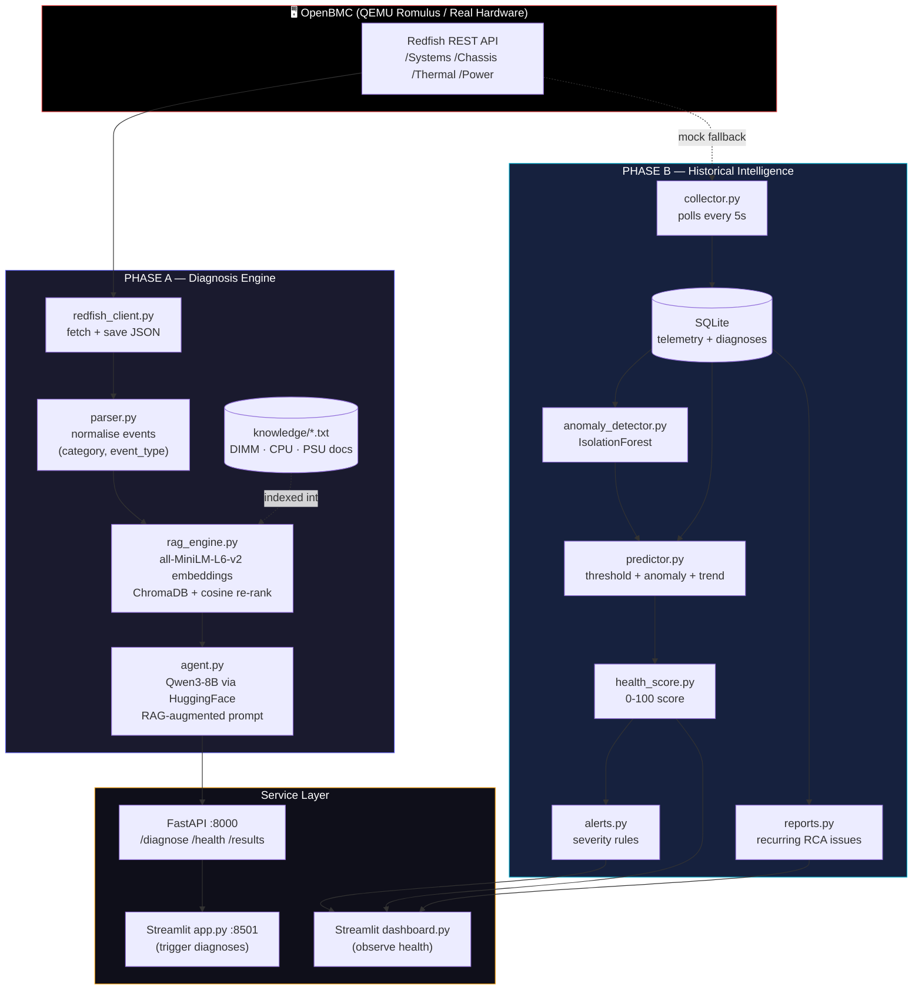
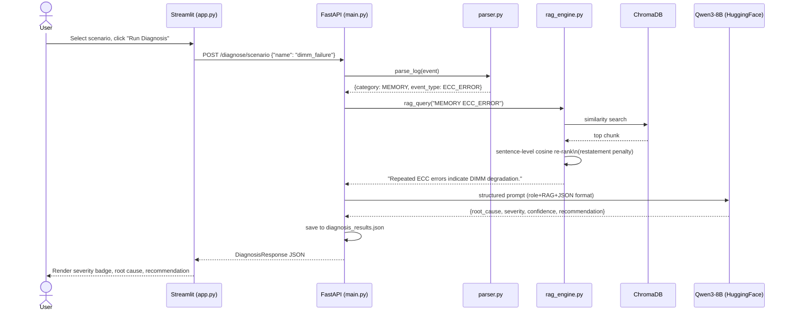
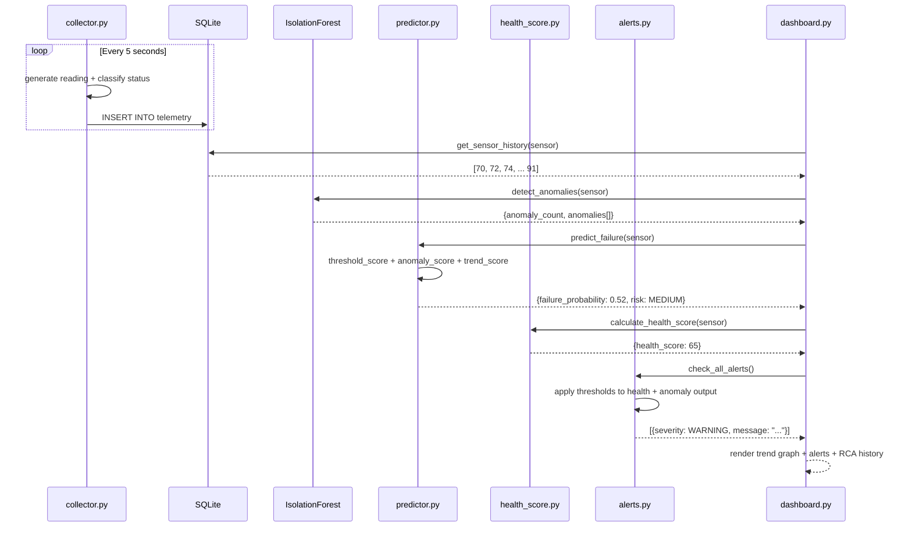
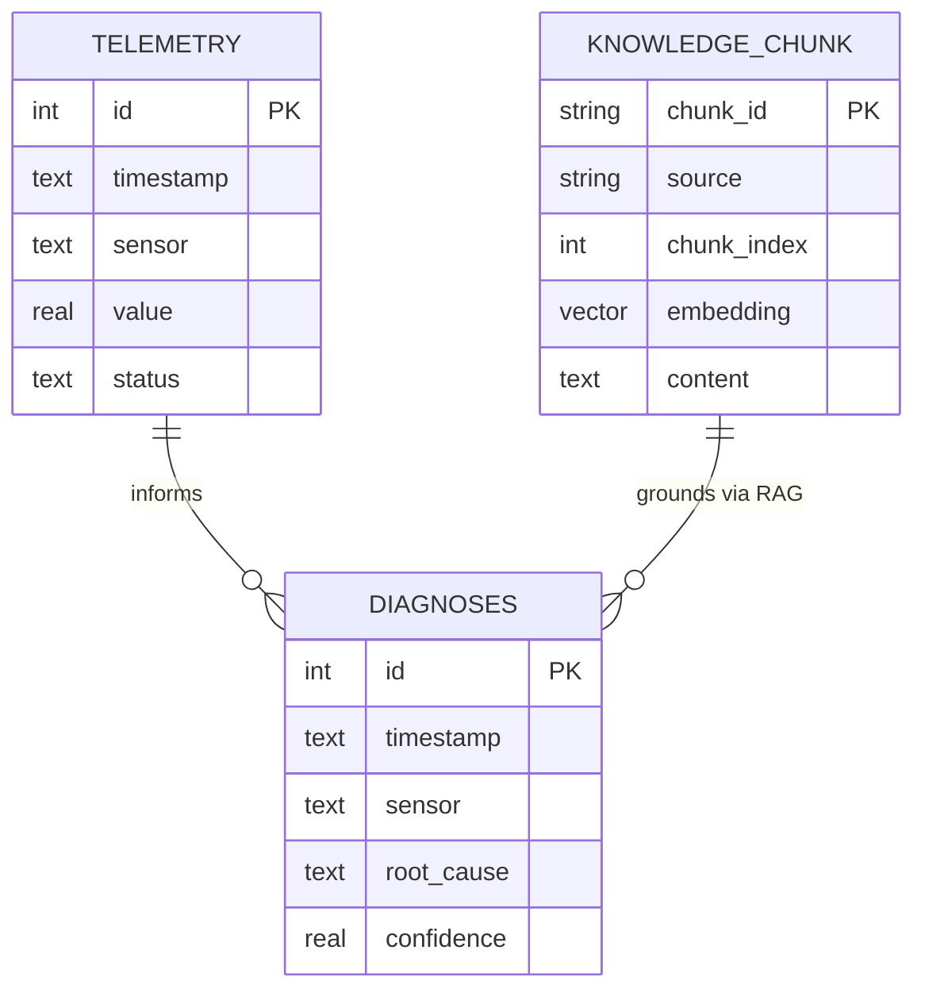
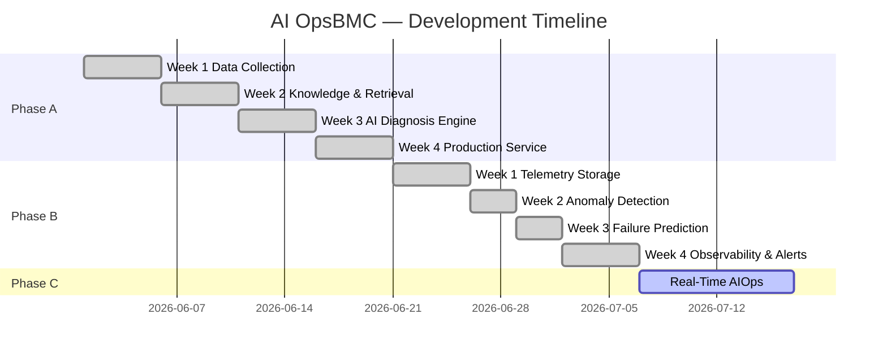

# AI OpsBMC — Architecture Diagrams

These render natively on GitHub — no image hosting needed. Paste any block directly into a `.md` file inside a ` ```mermaid ` fence.

---

## 1. Full System Architecture (Phase A + Phase B)



---

## 2. Phase A — Diagnosis Request Flow (Sequence)



---

## 3. Phase B — Telemetry to Alert Flow (Sequence)



---

## 4. Data Model (Entity Relationship)



---

## 5. Phase Roadmap (Gantt-style status)



---

### How to use these

1. Paste any block into `README.md` inside a ` ```mermaid ` code fence — GitHub renders it automatically, no plugin needed.
2. For a standalone image (e.g. for the Medium blog or PDF report), use the [Mermaid Live Editor](https://mermaid.live) — paste the code, export as PNG/SVG.
3. For VS Code, install the "Markdown Preview Mermaid Support" extension to preview locally before pushing.